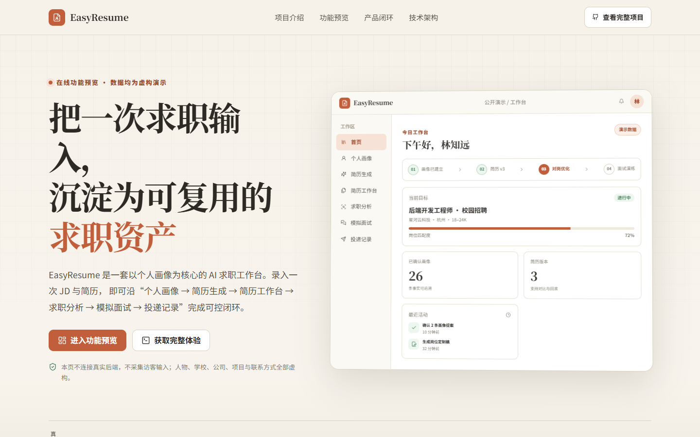

# EasyResume 公开在线预览



这是 EasyResume 的独立静态功能演示站，用于展示真实项目的模块结构、核心流程、预设数据产物与运行架构。

公开地址：[https://lzy22301093.github.io/](https://lzy22301093.github.io/)

## 演示内容

页面按 EasyResume 的真实产品主线组织：

1. 个人画像：分类、事实/待确认状态、证据来源、技能、投递方向、软性信息与画像摘要
2. 简历生成：准确的 8 步向导、画像导入、AI 表达包装、模板、篇幅与导出入口
3. 简历工作台：多版本文档、区域框选、区域改写候选、逐条采纳、对比与回滚
4. 求职分析：左侧对话与右侧 JD 分析、个人画像、Gap 分析、岗位定制、面试准备、调试
5. 模拟面试：准备、面试、报告、InterviewPlan、稳定问题标识与画像更新提案
6. 投递记录：状态筛选、搜索、汇总、公司/岗位/状态/结果/备注管理

页面还展示产品原则、版本闭环和真实运行时架构。

## 演示边界

- 页面只运行在浏览器本地，不连接 EasyResume 后端、LLM、ASR、TTS、WebSocket 或数据库。
- 模拟面试仅展示真实产品流程和预设结果，无法进行实时语音面试、实时追问和模型评价。
- AI 生成、岗位匹配、面试评价等均为静态 Mock 示例；完整能力需运行 EasyResume 项目。
- 人物“林知远”及所有学校、公司、项目、成绩、联系方式、公司岗位和分数均为虚构演示数据。
- 不包含项目作者或任何真实用户的个人信息。
- 页面不会上传、保存或发送访客输入。

## 为什么单独存放

本目录是独立站点仓库，不包含 EasyResume 源码、数据库、API Key、真实简历或后端服务。它与真实项目仓库分离，避免静态演示文件影响产品代码与部署。

## 目录

```text
.
├── index.html
├── styles.css
├── app.js
├── preview.png
├── .nojekyll
└── assets/
    ├── agent-workflow.png
    └── lucide.min.js
```

## 本地预览

在本目录运行：

```powershell
python -m http.server 4173
```

然后打开 `http://localhost:4173`。

## 隐私提醒

页面中的演示联系方式固定为 `resume-demo@example.com` 与 `+86 000 0000 0000`。发布前应继续确认页面、Git 历史和图片资源中没有真实邮箱、手机号、简历或其他敏感信息。
